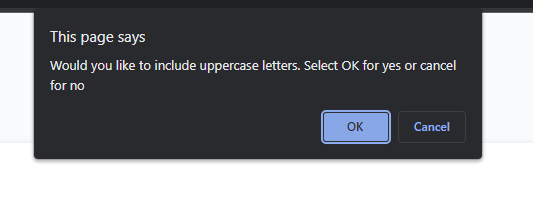

For challenge 3 we were given an index file,css file, and javascript file which when launched would take us to a password generator page as shown below. 

When the generate password button is pressed it will present a use with a series of prompts as shown below

However if the proper values are not chosen it will prompt users to choose a specified value within the range.

The following screenshots will show the rest of the prompts

When the criteria for the password is decided on it will display the generated password in the empty box as shown below.

The deployed application can be found here: 
https://emartinezcastellanos.github.io/javascript-password-generator/